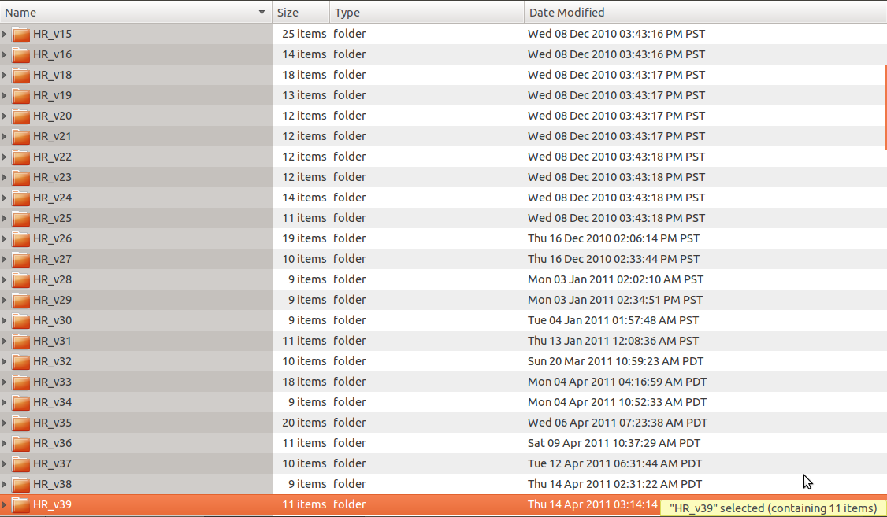
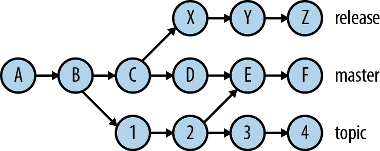
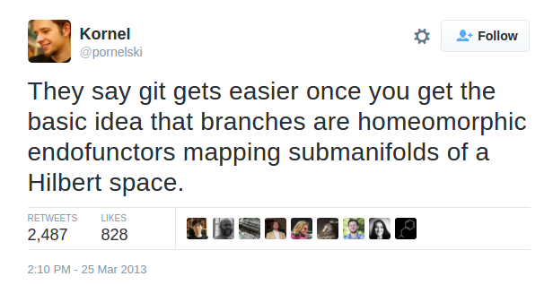
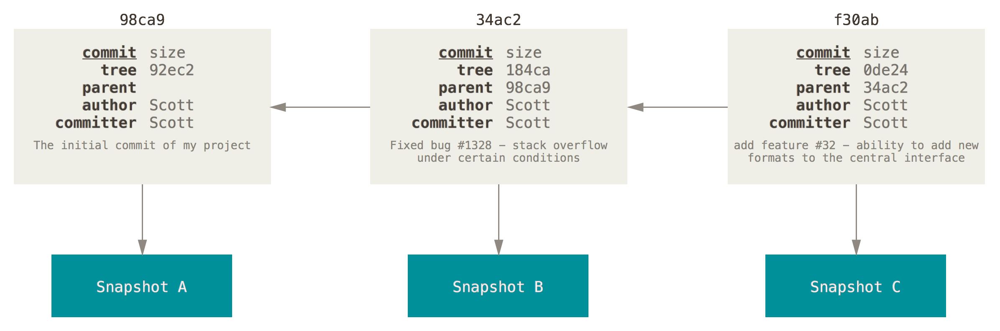
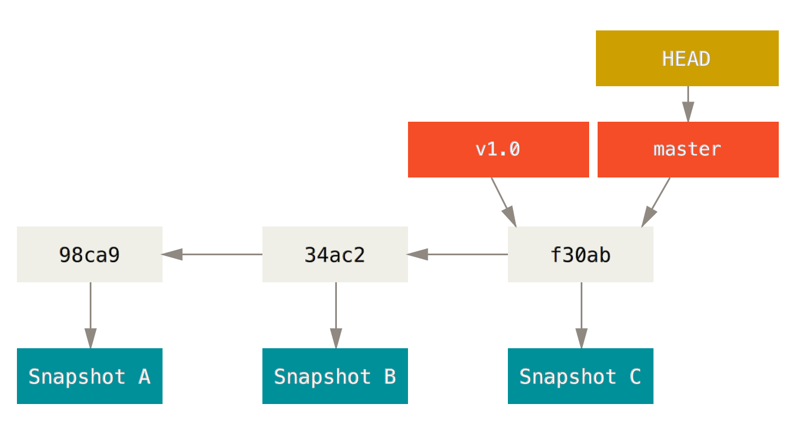

# Introduction to Git

## plus GitHub, R & Rstudio

---

## Why version control?

---


---



---

## Version control: metadata + history

* **who**: name of person making changes
* **when**: date and time change
* **what**: contents of files changed
* **why**: motivation for the change <!-- .element: class="fragment highlight-red" -->

...plus tools for working with the metadata

---

## Like a backup?

* why not just dropbox?
* what about time machine?

---

# Learning git


---

# Basic git terms

* **repository**: (or "repo") git's database.  Might be local or on GitHub
* **working copy**: all the files you actually work with
* **commit**:
  - as a noun: a snapshot of all the files in the repository
  - as a verb: create a snapshot
* **hash**: fingerprint of a file/repository

---

# Git history

 <!-- .element: class="fragment" -->
 <!-- .element: class="fragment" -->

---

## Interacting with git

* From the command line - eventually you will have to do this
* From a gui
  - Rstudio has a basic one built in
  - SourceTree and GitKraken are nice
  - GitHub has one
* Via GitHub

---

## The shortest bash tutorial

* `pwd`: what directory am I in?
* `cd`: change directory
* `ls`: list files
* `cp`: copy files (use `-r` for directories)
* `rm`: delete files (be careful)

---

# Basic git commands

* `git init`: initialise a repository
* `git add`: stage files
* `git commit`: add staged files to the repository by making a commit
* `git log`: see overview of what changed (does way too many different things)
* `git diff`: see details of what changed

---

## A few commands go a long way

```
grep '^git ' .bash_history  | awk '{print $2}' | sort | uniq -c | sort -rn
     82 status
     62 add
     39 commit
     26 log
     20 diff
     18 push
     16 clone
     14 remote
     10 checkout
      6 fetch
      5 ff
      2 show
      2 reset
      2 init
      1 statyus
      1 statuys
      1 stat
      1 satus
      1 rm
      1 puysh
```

---

## Things I need to remember to tell you

- git does not store diffs <!-- .element: class="fragment" -->
- but it is still really space efficient <!-- .element: class="fragment" -->
- git is a weird database more than version control <!-- .element: class="fragment" -->
- if you put something into git you can probably get it out again later <!-- .element: class="fragment" -->

---

## (end of part1)

---

 <!-- class="stretch" -->

---

## What makes a commit?


---

## The good, the bad and the ugly

- tiny change, big comment: https://github.com/wrathematics/getPass/commit/93afa4f

- calling amnesty on forgetting to use version control: https://github.com/richfitz/diversitree/commit/edde317

- changes to prose may not break down so nicely
https://github.com/richfitz/wood/commit/0a40e30

---

## Ideally

* One set of related changes
* Commit message explains why they were needed
* Short title (<60 characters)
* Blank line, then any further discussion

---

## Not everything goes in git

 <!-- class="stretch" -->

---

## Not everything goes in git

* Large files
* Passwords
* Outputs (sometimes)
* Use `.gitignore`

---

## .gitignore

```
.Rproj.user
.Rhistory
.RData
src/*.o
src/*.so
src/*.dll
inst/examples/*.o
inst/examples/*.so
inst/examples/*.dll
ignore/
dde_*.tar.gz
notes.md
src/dde.so.dSYM
tests/testthat/*.so.dSYM
src/*.gcda
src/*.gcno
inst/doc
vignettes/*.html
inst/web
```

---

# Branches



---

# Graphs

 <!-- .element: class="fragment" -->
 <!-- .element: class="fragment" -->

---

# Graphs



---

# Graphs



---

## Remote git commands

* `git clone`: download a repository
* `git fetch`: update remote changes but don't apply them
* `git pull`: update remote changes and do apply them
* `git push`: send your changes upstream
* `git remote`: inspect / change details of upstream repositories
* `git branch`: inspect / create a branch
* `git checkout -b`: create a branch and change to it (yes this is stupid)
* `git merge`: merge branches

---

# GitHub things

* issues
* pull requests
* hosting webpages on gh-pages
* organisations
* the `mrc-ide` organisation

---

# Rstudio and GitHub

* not all commands are supported but the basic ones are
* get to the shell for the rest
* do whatever means you use it
* You _must_ use a project to use git in Rstudio
